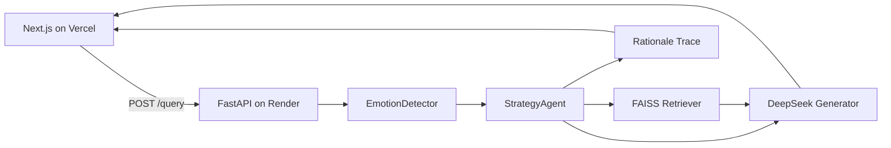

# Emotion-Aware Agentic RAG

A small, hostable **research demo** of emotion-aware retrieval and generation: the agent detects affect in the user query, chooses a retrieval/generation strategy, answers from a tiny FAQ corpus, and surfaces **why** it chose that strategy.

> Explores how affective signals can guide agentic RAG — combining emotion detection, strategy selection, and explainable decision traces.

## Motivation

Standard RAG pipelines treat every query the same. In support and tutoring settings, **frustration**, **confusion**, and **curiosity** call for different retrieval budgets and answer shapes. This mini-system:

1. **Affective AI** — tags each query with a pretrained text emotion classifier.
2. **Agentic RAG** — a decision layer maps emotion → strategy (`concise` / `scaffolded` / `standard`) that changes top-k, score filters, preferred doc types, and system prompts.
3. **Explainable AI** — every response includes a one-line rationale, e.g. `Detected emotion: anger (0.82) -> concise mode…`.

## Architecture



| Strategy | Trigger (examples) | Retrieval | Generation |
|---|---|---|---|
| `concise` | anger, disgust, fear | smaller top-k, higher min score, prefer FAQ | short, reassuring |
| `scaffolded` | sadness or low-confidence | larger top-k, prefer how-to | numbered steps |
| `standard` | joy, neutral, surprise | balanced | informative mid-length |

## Stack

- **API:** FastAPI · DeepSeek (`deepseek-chat`) for emotion + generation · TF-IDF retrieval
- **UI:** Next.js (App Router) on Vercel
- **Hosting:** Render (Docker web service) + Vercel

## Repo layout

```
backend/          FastAPI service, docs corpus, eval
frontend/         Next.js demo UI
```

## Local development

### Backend

```bash
cd backend
python -m venv .venv
# Windows: .venv\Scripts\activate
source .venv/bin/activate
pip install -r requirements.txt
cp .env.example .env   # set DEEPSEEK_API_KEY
uvicorn app.main:app --reload --host 0.0.0.0 --port 8000
```

- Health: `GET http://localhost:8000/health`
- Query: `POST /query` with `{"query":"..."}`
- Eval fixtures: `GET /eval/sample`

### Frontend

```bash
cd frontend
cp .env.example .env.local   # NEXT_PUBLIC_API_URL=http://localhost:8000
npm install
npm run dev
```

Open [http://localhost:3000](http://localhost:3000). Use **Compare** to run the same intent with different emotional framings side-by-side.

### Refresh eval table (optional)

```bash
cd backend
python -m eval.run_comparison --api http://localhost:8000
```

See [`backend/eval/comparison_results.md`](backend/eval/comparison_results.md).

## Live demo

- **UI:** [https://emotion-aware-rag-gold.vercel.app](https://emotion-aware-rag-gold.vercel.app)
- **API:** [https://emotion-aware-rag.onrender.com](https://emotion-aware-rag.onrender.com) · health at `/health`

## Deploy

### 1. Render (API)

1. Push this repo to GitHub.
2. New **Web Service** → Docker, root directory `backend` (or Blueprint [`backend/render.yaml`](backend/render.yaml)).
3. Set env vars:
   - `DEEPSEEK_API_KEY` — required
   - `DEEPSEEK_MODEL` — `deepseek-v4-flash` (default; override if your account uses another id)
   - `CORS_ORIGINS` — your Vercel URL, e.g. `https://your-app.vercel.app`
4. Health check path: `/health`
5. First boot downloads are avoided by the Dockerfile model prefetch; free-tier **cold starts after idle** can still take ~30–60s.

The process binds `0.0.0.0:$PORT` as required by Render.

### 2. Vercel (UI)

1. Import the repo; set **Root Directory** to `frontend`.
2. Env: `NEXT_PUBLIC_API_URL=https://your-service.onrender.com`
3. Deploy, then add that Vercel origin to Render `CORS_ORIGINS`.

## Research summary

This demo investigates whether user affect should influence how a RAG agent retrieves context and shapes its answers. It combines a pretrained emotion classifier, a lightweight strategy controller, and an explicit rationale trace so each response records *why* a given mode was chosen — bridging affective computing, agentic RAG, and explainable AI in one minimal system.

## License

MIT — demo code for research communication.
